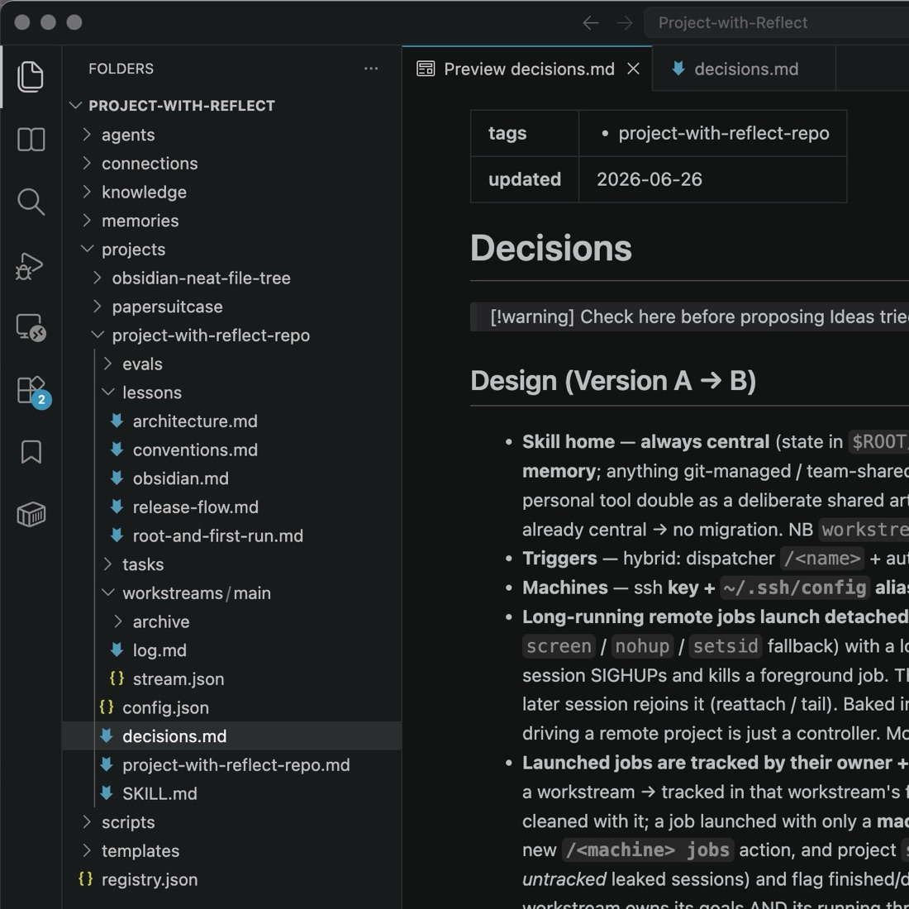
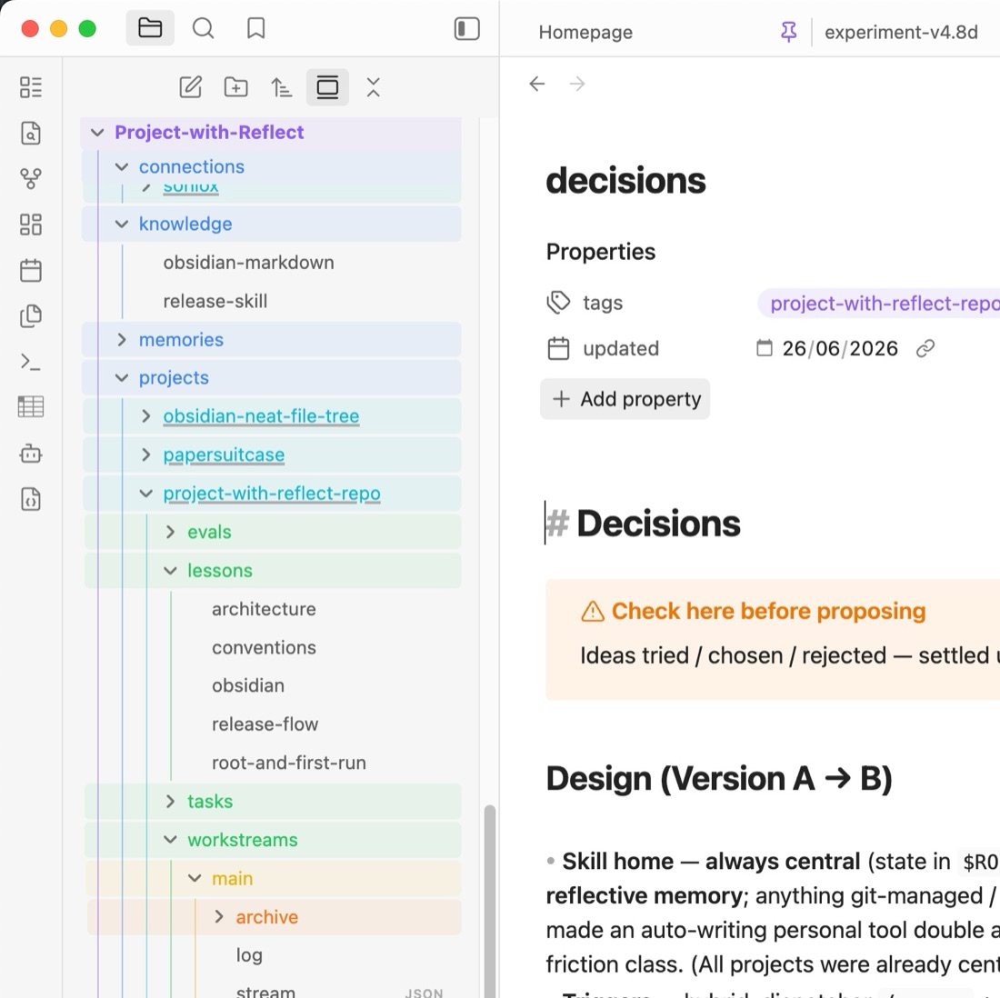

# project-with-reflect

> 一个面向 Codex、Claude Code 和其他 AI coding agents 的**帮你蒸馏自己的** meta-skill。 —— Neil Z. Shao
>
> 搭配 [Obsidian](https://obsidian.md) 和插件体验最佳：
> - [Neat File Tree](https://github.com/initialneil/obsidian-neat-file-tree) —— 更清爽的文件树。
> - [Folder Notes](https://github.com/lostpaul/obsidian-folder-notes) —— 更好的 `<folder>/<folder>.md` folder-note 显示（experiment record、eval、每条 workstream 的 goal log）。

你是否**同时管理多个项目**？是否要**记住好几台**机器、服务的连接方式？是否厌烦了**反复写大段重复**的
prompt、向 agent **一遍遍解释**同一个项目的来龙去脉？

它帮你把每个 **project** 管起来——worktree、log、reflect、沉淀出**长期知识库**；也帮你管理一切你
要**操作的东西**（connection），每个都成为可直接调用的 `/<name>` skill：

- **服务器** —— ssh 部署 / 看日志 / 跑命令
- **训练机** —— GPU 机器：跑训练 / `nvidia-smi`，记住它的 quirks（如重启后 `nvidia-smi -pl 300`）
- **设备 device** —— USB / 串口烧录目标（开发板…）：flash / monitor / REPL
- **API** —— HTTP / WebSocket 服务（只把 key 的环境变量**名字**落盘，绝不存 key 本身）
- **MCP** —— MCP server，直接用它的 `mcp__<name>__*` tools

而且全程 **Obsidian 友好**（lessons / 知识 / dashboard 都是干净可读的 Markdown）。

<p align="center"><em>你的个人知识库 —— 在编辑器和笔记软件里都清晰可读：</em></p>

<table>
  <tr>
    <td width="50%" align="center"></td>
    <td width="50%" align="center"></td>
  </tr>
  <tr>
    <td align="center"><sub>Show your knowledge base in VS Code</sub></td>
    <td align="center"><sub>Show your knowledge base in Obsidian</sub></td>
  </tr>
</table>

## 一眼看懂 At a glance

- **万物皆 skill** —— project 和上面每个 connection，注册后都得到自己的 `/<name>`。
- **工作时自动 log** —— commit、决定、关键发现、实验结果、error + 修复，随手记进当前 stream。
- **原生 hooks 提醒记忆卫生** —— 大块工作前 checkin，风险命令前重读磁盘记忆，编辑/发现后记录，compact 前 flush。
- **`reflect` 蒸馏自己** —— 先 capture 这次 session，再把 log 提炼成**精简、可读的 lessons**，下次自动加载（实验结果则追加进一份永久的 **experiment record**）。
- **checkin 从磁盘重启状态** —— 开始工作前，agent 重新加载 goal / plan、进展、发现和失败尝试。
- **动手前先加载** —— agent 先读已有 lessons / decisions / 知识，不再重复解释、重复犯错。
- **跨 agent 使用** —— Claude Code 走 plugin flow；Codex 和其他 agents 使用这个 repo 里的 skill surfaces。

> **核心循环 core loop：** `work（自动 log）→ /<project> reflect（capture + 提炼）→ 精简可读 lessons → 下次更好`

## 安装 Install

**优雅的发布版安装：**

Claude Code 现在有最顺手的一等 marketplace 流程：

```
/plugin marketplace add initialneil/project-with-reflect
/plugin install project-with-reflect@project-with-reflect
```

Codex 和其他支持 Agent Skills installer 的 agent，可以用开放的 skills CLI：

```
npx skills add initialneil/project-with-reflect
```

**Codex 本地 / 开发安装：**

如果你正从 checkout 开发，或当前 agent 还没有把 skills CLI 自动接到 Codex 的 user skill 目录，
用这个 fallback：

```
mkdir -p ~/.codex/skills
ln -sfn /path/to/project-with-reflect/.codex/skills/project-with-reflect ~/.codex/skills/project-with-reflect
```

## 快速上手 Quick start

日常循环是：**注册 → status / checkin → 开始工作 → log-and-reflect 收尾**。

**1. 注册一次**

```
# 注册一个 project → 生成 /myapp skill
/register-project myapp ~/code/myapp

# 可选：注册一条可复用 workstream —— 直接说它基于哪条
/register-workstream my-feature 基于 main        # → 生成 /myapp-my-feature
```

**2. 开始前 status / checkin**

```
# 可以在任何位置执行，哪怕 ~
/project-with-reflect status        # 列出 project / connection，并标出哪些需要注意
/myapp checkin                      # 加载上下文，询问 cwd，然后用 status recap
/myapp checkin train-v2             # 或直接 checkin 进具体 workstream
```

**3. 工作、record、reflect**

```
/myapp-my-feature …                          # （或直接 /myapp 用主 workstream）
/record-a-lesson v2 baseline：测试集 0.83 F1   # 立刻持久化一个结果/结论（≡ /myapp record "…"）
/log-and-reflect          # 在 repo 里任意位置 —— 自动按 cwd 找到 project
# （≡ /myapp reflect —— reflect 本来就会先 capture）
```

`status` 是**智能简报**（Where · Recap · TODO · Workstreams · flags），不是 dump。`checkin` 是
**一个 working session 的入口** —— 它加载上下文、处理 cwd、**静默地把终端 tab 标题设为 project + workstream**
（iTerm2 / Terminal / 任意支持 OSC 的终端；其它环境自动跳过），并**以 `status` 收尾**，让你从磁盘恢复出
当前 goal / plan、已完成、已学到、下一步，以及失败或风险点。
（connection 也有：`/gpubox checkin` 会 ssh-ping 这台机器、应用它的 quirks、再给一份简报。）

> **`/compact` 或 `/clear` 之后，请再 `/<project> checkin` 一次。** 两者都会把已加载的 lessons / recap
> 从上下文里清掉（cwd 和 tab 标题仍在），重新 checkin 让你重新进入状态。两者都**不会**触发 `reflect` ——
> 想把这段 session 蒸馏成 lessons，请先 `/log-and-reflect`。

## 命令速查 Command reference

> 你用**大白话**说要做什么 —— 下面的名字和 flag 是 agent 替你填的，不用背（比如「开一条 v081，
> 基于 v080，只追踪」「Soniox 这个 API，key 在 `SONIOX_API_KEY`」）。

**总体**（`/project-with-reflect`）：

```
/project-with-reflect           # 无参 → help；另有：status [<name>] · checkin [<name>] · doctor [<name>] · list · meta-reflect
/register-project   <name>
/register-machine   <name>      # ssh 服务器 / cloud VM
/register-device    <name>      # USB / serial 烧录目标
/register-api       <name>      # http endpoint + key-env
/register-mcp       <name>      # mcp server + 它的 tools
/register-knowledge <name>      # 跨 project 可复用的 recipe
/register-agent     <name>
```

**在 repo 里**（顶层快捷命令，从 cwd 解析出当前 project，不用加 `/<name>` 前缀）：

```
/log-and-reflect [<target>] [--reground]   # = /<name> reflect，在 repo 里任意位置可用
/record-a-lesson "…"                        # = /<name> record（沉淀一条 result / rule / reference）
/register-workstream <b> --base <x>         # = /<name> register-workstream
/update <name> "…"                          # 把内容折叠进某个 knowledge / connection note
```

**单个 project**（`/<name>`）：

```
/<name>                           # 无参 → checkin（加载 + cwd 决策 + 自动 status）
/<name> status                    # 智能简报：在哪 · recap · todo · workstreams（非 dump）
/<name> checkin [<workstream>]    # 入口；无参 → project 主目录
/<name> record "…"                # 立刻沉淀一条 durable lesson
/<name> note "…"                  # 临时 log 一行
/<name> reflect [<target>] [--reground]
/<name> todo                      # backlog
/<name> bind --connection <c> [--build "…"]
/<name> build | flash | monitor   # 通过绑定的 device / server
/<name> register-workstream <b> --base <x>
/<name>-<b> [pr | rebase | reset] # 这条 workstream 自己的命令
/<name> register-eval <e>  ·  eval all
/<name> register-task <t>
/<name> use-knowledge <k>
/<name> bootstrap | streams | list | help
```

**单个 connection**（`/<name>`，按 transport）：

```
/<name> checkin                   # 验证可达 + 应用 quirks + 自动 status
/<name> status                    # 智能简报
/<name> <cmd>                      # ssh：在 host 上跑命令
/<name> flash | monitor | reconnect wifi | repl   # serial
/<name> <call>                     # http / mcp
/<name> note "…" · update "…" · reflect           # reflect 把 log 折叠进 ## Quirks
```

统一的 ergonomic：**注册一个 handle → 得到 `/<name>-<handle>`**
（一条 workstream、一个 eval test case、或一个 task runbook）。

## 常见工作流 Common workflows

**远程 / 多 repo 的 project** —— 代码在服务器上（本地没有 checkout）、还可能横跨多个 repo？直接
**用大白话描述**就行 —— agent 会替你注册 host、记录各个 root，不用记任何 flag 语法：

```
/register-project myapp —— 它在 gpubox 服务器的 /srv/myapp，另外还用到 /srv/dataset 这个数据集 repo
```
如果 gpubox 还不是 connection，agent 会先把它注册成 ssh connection（key-based，磁盘上不存密码），
把两个 repo 记为 root 并 bind 上 host。然后 `/myapp bootstrap` 通过 ssh 从这些 repo seed 出
lessons + decisions。之后在任意位置开一个 session，说 **`/myapp work on <workstream>`** —— 它会先征求你同意
再切进那条 workstream 的目录，于是 planning / 工作文件都留在 vault 里（绝不弄乱服务器或你的 `~`），
同时 `/myapp` 通过 `/gpubox` 在 host 上 build / test。

也能把设备 / 服务变成 skill——`/register-device`、`/register-api`、`/register-mcp`、
`/register-machine`；project `bind` 之后可直接 build / flash / 调用。

**在一个本身基于更旧 branch 的 version branch 上做 bug-fix stream：**

```
/app register-workstream v090 --base v080 --track-only   # 仅 lineage：v090 tracks v080（共享分支 / PR 目标，不开 worktree）
/app register-workstream v090-bug-fix --base v090        # 在 app/.claude/worktrees/v090-bug-fix 开 worktree，从 origin/v090 fork
/app-v090-bug-fix                                     # checkin：cd 进 worktree + recap；开发（自动 log）
/app-v090-bug-fix pr                                  # 若 origin/v090 有更新会询问是否 rebase；若 v090 相对 v080 已 stale，会询问先 rebase v090；再 gh pr create --base v090
# …PR 合并后…
/app-v090-bug-fix reset                               # 把这条 workstream 重置到最新 v090，准备下一个 PR
```
version lineage 就是 `base` 指针链 `v080 ← v090 ← v090-bug-fix`；`pr` 会沿着这条链走，
**任何 rebase 前都会先询问**，让你绝不会 PR 到一个 stale 的目标。worktree workstream 默认落在
`<repo>/.claude/worktrees/<workstream>`（自动创建、不进 git）；一个 workstream 是**可复用的 workstream**，不是一次性的。

**横跨一个 device 和一台 cloud server 的固件 project：**

```
/register-device cardputer-adv   # autodetect board + /dev/cu.usb*；写 connection.json + flash/monitor
/register-machine gcs-server     # ssh connection；还没有？描述它 —— agent 引导 provider 配置 + billing，先确认费用
/register-project splattingavatar ~/code/splattingavatar
/splattingavatar bind --connection cardputer-adv --connection gcs-server
/splattingavatar build && /splattingavatar flash && /splattingavatar monitor   # 把 server endpoint 编进固件、通过 USB flash、看它连上 server
```
每个也都是自己的 skill —— `/cardputer-adv flash`、`/gcs-server <cmd>`；project 里的 `flash`/`monitor`
会委托给它，于是它学到的 quirks 自动生效。

## 首次运行：选 root  First run

首次运行会询问 `$PROJECT_WITH_REFLECT_ROOT` 放哪。**推荐用一个 custom、可同步、可读的
路径** —— 你的 Obsidian vault，或一个云文件同步文件夹（Dropbox / Google Drive / OneDrive /
iCloud / Nutstore），在其中用一个 `Project-with-Reflect` 文件夹，这样 lessons 和 knowledge
能跨机器同步、也方便阅读；`~/.project-with-reflect` 是不同步的默认值。（Notion / Google Docs
不是本地文件夹，不能作为 root —— root 必须是真实的本地目录。）选择会被保存（pointer + shell rc）。

## 心智模型 Mental model

```
$PROJECT_WITH_REFLECT_ROOT/
  projects/<name>/      每个 project 的 skill + 状态
  connections/<name>/   你操作的一切 —— ssh | serial | http | mcp —— 每个都是自己的 /<name> skill
  knowledge/            全局、可被 agent 使用的参考笔记，project 按需 opt-in
  memories/             长期全局事实（保持精简）
  agents/  templates/  scripts/  registry.json
```

connection **磁盘上不存任何 secret** —— 只存放 key 的环境变量**名字**（如 `SONIOX_API_KEY`），
绝不存 key 本身或 ssh 密码。

每个 project：

```
projects/<name>/
  SKILL.md             自包含的 dispatcher + behavioral contract
  <name>.md            人类看的 dashboard（含 ## TODO backlog）—— 由 reflect 重新生成
  lessons/<name>.md    各种 lessons，扁平存放（rules · 参考 · review · 研究报告）；
                       多数 bounded-update，少数 append-only —— 如 experiment-GUAVA.md 累积 run 记录
  workstreams/<workstream>/ stream.json + log.md （log 按 workstream 存放）
  decisions.md         试过 / 选定 / 否决的想法 —— 提议前先查
  evals/<eval>/  tasks/<task>.md  config.json
```

每个 connection（一个 skill，按 transport）：
```
connections/<name>/
  connection.json      transport + facts（port/board · ssh alias · base_url/key_env · mcp tools · docs_url）
  <name>.md            facts（frontmatter）+ 学到的 ## Quirks
  SKILL.md   log.md    /<name> flash|monitor|call|… → reflect 把 log 折叠进 quirks
```

## 支持的 Agents Supported agents

规范的 skill 源码在 `skills/project-with-reflect/`。各个 agent 的入口只做镜像或轻量适配，
这样同一个 repo 可以发布给常见 coding agents：

| Agent | 支持方式 | 入口 |
| --- | --- | --- |
| Codex | 一等 skill 安装 | `.codex/skills/project-with-reflect/` |
| Claude Code | Plugin + skill + slash commands/hooks | `.claude-plugin/`、`skills/project-with-reflect/`、`commands/` |
| 通用 agent CLI | repo 级说明 | `AGENTS.md`、`llms.txt` |
| Cursor | rule adapter | `.cursor/rules/project-with-reflect.mdc` |
| Gemini CLI | context adapter | `.gemini/GEMINI.md` |
| OpenCode | agent instructions | `.opencode/AGENTS.md` |
| Continue | prompt adapter | `.continue/prompts/project-with-reflect.md` |
| GitHub Copilot coding agent | repo 级说明 | `.github/copilot-instructions.md` |

Codex 和 Claude Code 的支持最完整，因为 project-with-reflect 会把生成出来的 project /
connection skills 同时安装进两个 user-scope skill 目录：

```
~/.codex/skills/<name>
~/.claude/skills/<name>
```

如果一个较早用 Claude 创建的 project 已经在 root 里，但 Codex 找不到 `/<name>`，
运行 `/project-with-reflect doctor [<name>]`，它会修复 root pointer 和生成 skill 的链接。

其他 agents 也能复用同一份生成的 `SKILL.md`：加载 repo 级说明，或把
`$PROJECT_WITH_REFLECT_ROOT/projects/<name>` 和
`$PROJECT_WITH_REFLECT_ROOT/connections/<name>` 复制 / symlink 到它们自己的 skill 或 rule 目录。

## Bootstrap

两个 `bootstrap` 帮你从零到可用：

- **`/project-with-reflect bootstrap [path]`** —— （重新）配置 root：询问 `$PROJECT_WITH_REFLECT_ROOT`
  放哪（推荐可同步、可读的路径）并建好。用于注册前的初始化、迁移 root、或修复丢失的 pointer。
- **`/<name> bootstrap`** —— *用已有内容给一个刚注册的 project 灌入初始记忆。* agent 读 repo 的文档
  （README、specs、CHANGELOG）、浏览代码、并结合当前 session，做一次初始 reflect：写出
  `lessons/<topic>.md` 模块、把已做的决定填进 `decisions.md`、生成 `<name>.md` dashboard。这样今天注册的
  project 一开始就是满的，而不是空的 —— 提炼，而非杜撰。

## Behavioral contract（让它真正有用的关键）

每个生成的 `/<name>` 都会让 agent 在**动手前**：
1. **先加载，再提议** —— 读 `<name>.md` + `decisions.md` + 匹配的 lesson modules。
2. **提议前先查 ledger** —— 如果它已在 `decisions.md` 里，引用它，绝不盲目重复提议。
3. **绝不擅自改 guarded state** —— dataset、训练 settings、branch/release 约定都是 invariants。
4. **主动 surface** 相关的 lessons 和已注册的 evals。
5. **了解你的 connections**（服务器 / 训练机 / 设备 / API / MCP）—— 通过 connection 自己的 `/<name>`
   skill 去操作它（会自动套用它学到的 quirks）；`connection.json` 提供硬事实，绝不靠猜 port / host / endpoint。

正是这个 contract，让记录 log 变成**更少**的重复劳动，而不是更多的文件。

## Reflect = bounded update

`reflect` 是 **log-and-reflect**：它先 **capture 这次 session**（把这段对话里还没记进 log
的关键事件追加进去——project 发现进当前 stream 的 log，设备/API 的发现进对应 connection 的
log），**再**按类型分流：**累积型结果**（一次 run 的 config + metric + verdict）**追加**进
一份扁平的永久 record lesson（`lessons/experiment-<name>.md`——绝不重写或归档，所以即使 host 上的输出被
清掉、数字也还在，并沿用该 lesson 既有的格式）；**其余**则折叠进对应的 `lessons/<topic>.md` + `decisions.md`，
修正错误的 lessons，**太长就拆**。当这次 sweep 翻出一件当下没来得及 `record` 的**值得永久保存的东西**——一个
baseline、一句“X 比 Y 好”、一份值得留存的 reference——reflect 会**自然地为它触发 `record`**（`record` 是原子动作，
reflect 是 session 收尾时的兜底）。然后重新生成 `<name>.md`，归档已消化的 **log**（lessons 不归档），
并报告改了什么。所以一句 `/<project> reflect` 就是整个 session 收尾的习惯，
不用单独“log”一步。可以 `/<project> reflect`，或在 repo 里任意位置用 **`/log-and-reflect`**（自动按 cwd
找到 project）。`--reground` 会对某个 distilled module 做完整重写。可读性说了算。

`reflect` 还会**标记代码改进项**（log 里反复出现的失败、被反复改的模块）—— 你按正常开发去改，或用
`todo` 先记下；它**绝不擅自改源码**。而且 log 不靠你盯着：两个非阻塞 **hook**（每次 `git commit` 提醒、
compaction 前 flush）+ reflect 的 capture-first 兜底，让 log 始终是新的。

## 致谢 Acknowledgements

Inspired by my dear friend Zhaolong WANG from Tsinghua.

并借鉴了这些项目的思路：
- [hermes-agent](https://github.com/nousresearch/hermes-agent) —— closed learning loop。
- [grounding-rules](https://github.com/initialneil/grounding-rules) —— 精简、可读的 rules。
- [planning-with-files](https://github.com/othmanadi/planning-with-files) —— 持久 Markdown 工作记忆的哲学；启发了 PWR 原生的 checkin reboot、两次观察就落盘，以及显式记录失败尝试。

## License

MIT © initialneil
